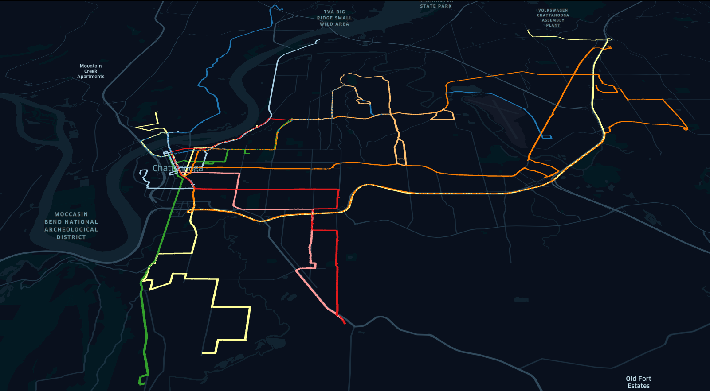
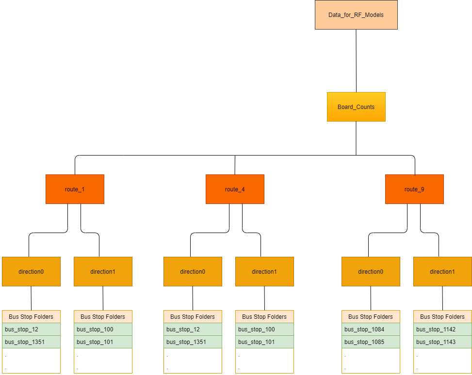

# Public Transportation Demand

<figure class = "image">
 
 <figcaption align = "center">Figure 1. GTFS CARTA Dataset and its inbound routes.</figcaption>
</figure>

This part

<!-- TABLE OF CONTENTS -->
## Table of Contents

* [Overview](#overview)
  * [Getting Started](#getting-started)
* [Main Files](#main-files)
  * [Aggregated Performances](#aggregated-performances)
* [Folders and Characteristics](#files-characteristics)
  * [Pictures](#folder1)
  * [Data_Example](#data-example)
  * [Related Notebooks](#related-notebooks)
* [Contribution](#contribution)
* [License](#license)
* [Contact](#contact)
* [Acknowledgements](#acknowledgements)

## Overview

<figure class = "image">
 
 <figcaption align = "right">Figure 2. Data Structure.</figcaption>
</figure>

In this part of our repository you will find information about board count modeling at the bus stop level, and maximum occupancy at the trip level. The Models at the bus stop level were trained using data that was grouped by `route_id`, `direction id`, `stop_id`, and data partition. We created a unique folder for each bus stop to store the models and relevant data. The path to these folders follows a hierarchical structure given by their `route_id`, `direction id`, `stop_id`, and data partition. Therefore, we created two notebooks to aggregate the data. 

Similarly, the trip data was grouped by `route_id`, `direction id`, and data partition. We created a unique folder for each trip.v

### Getting Started

R is an open source software that can be downloaded from [R Cran](https://cran.r-project.org/). Also, **R Studio** is the most widely used interpreter, and it can be downloaded from [R Studio](https://rstudio.com/). 

## Main Files

We performed two different data prepartions. One for the bus stop level analysis, and another one for the trip analysis.

* `Data_Preparation.ipynb`

### Aggregated Performances

#### Bus Stop Level

* `Rand_Forest_ML.ipynb`
* `Rand_Forest_ML2.ipynb`
* `All_GLM_Models_Performance.ipynb`
* `RF_Performance.ipynb`

#### Trip Level

* 

## Folders and Characteristics

### Folder 1

### Related Notebooks

This folder is where the analysis and results are kept. 

* `Data_Preparation.ipynb`: This notebook is written in python and prepares the data (in this case the CARTA dataset) for regression. Part of its main function is export the prepared data as `*.csv` to a folder that characterizes its dependendent variable (board or alight counts) and its `route_id`, `direction_id`, and `stop_id`.
*  `Carta2018_gtfs_segments`: This notebook explains how to use (or apply) the `gtfs_functions` package using the 2018 gtfs CARTA data. Although, it shows we can reproduce all the processes without problems, we still need to design a way to 'automatize' the gtfs schedules with the data-times of the APC data. Once we solve this, we could simulataneously query (or model) gtfs (using `gtfs_functions`) data and APC data.
*  `Data_Example`: This folder has some data that can be used to run the notebooks.
* `Rand_Forest_L.ipynb`: This notebook contains the Random Forest based models at the bus stop level. This code was written in R. There two models in this notebook: Zero-Inflated Random Forest and (Vanilla) Random Forest.
* `Trip_Analysis1.ipynb`: This notebook contains the Random Forest based models at the trip stop level. This code was written in R.

## Contribution

## License

## Contact

## Acknowledgements

This material is based upon work supported by the Department of Energy, Office of Energy Efficiency and Renewable Energy (EERE), under Award Number DE-EE0008467 and National Science Foundation through award numbers 1818901, 1952011, 2029950 and 2029952. The authors will also like to acknowledge the computation resources provided by the Research Computing Data Core at the University of Houston and through cloud research credits provided by Google.
